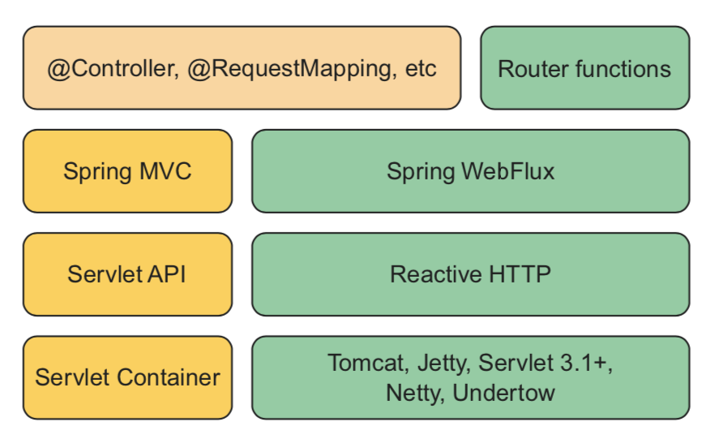

# Key Points

## Reactor 介绍

`Imperative` 模式：任务由多个子任务构成，数据在只有在一个子任务处理完后才会交给下一个子任务。

`Reactive` 模式：数据也是由多个子任务处理，但是子任务之间是可以并行执行的，每个子任务只处理一部分数据，处理完后交给下一个子任务，同时自己开始处理另一部分数据。

Imperative 和 Reactive 模式，有各自的适用场景，并没有谁更优之说。

Imperative 模式的优点是直观、容易理解。主要缺点是，容易导致阻塞，比如一个线程执行一个耗时操作（如读写数据库或访问远程资源），当前线程就会阻塞等待。当然多线程可以在一定程度上解决问题，但是多线程带来的复杂性也是不容忽略的。

相反，Reactive 模式天生就是函数式的，通过定义数据流动的 pipeline 或 stream，在数据到达的时候才处理，而不是一次处理所有的数据。

`Backpressure`：通过控制数据源产生数据的速率，以免消费者来不及处理而被淹没。

Reactor 主要有两种数据类型：`Mono`和`Flux`，其中`Mono`表示单个元素，`Flux`表示多个元素。Reactive Stream 与 Java Stream 操作有一些相似之处：

### 创建

```java
Mono.just("hello");
Mono.justOrEmpty(Optional.empty());

Flux.just("hello", "world", "!");
Flux.fromArray(new String[]{"hello", "world", "!"});
Flux.fromIterable(List.of("hello", "world", "!"));
Flux.fromStream(Stream.of("hello", "world", "!"));
Flux.range(0, 4);
Flux.interval(Duration.ofMillis(100)).take(5);
```

### 操作

```java
Flux<Integer> flux1 = Flux.just(0, 1);
Flux<Integer> flux2 = Flux.just(2, 3);
flux1.mergeWith(flux2);

Flux<Integer> flux3 = Flux.just(0, 2);
Flux<Integer> flux4 = Flux.just(1, 3);
flux3.zipWith(flux4);

Flux.just("Kobe", "Durant", "Curry").map(String::length);

Flux<Integer> length = Flux.just("Kobe", "Durant", "Curry")
  .flatMap(name -> Mono.just(name).map(String::length).subscribeOn(Schedulers.parallel()));
```

### Reactive Stream 工作流

Publisher：可以看作数据的生产者，`Publisher`接口只有一个方法：

    public void subscribe(Subscriber<? super T> s);

Subscriber：数据的消费者，通过`Publisher`的`subscribe()`方法订阅数据。

Processor：数据处理器，作为`Subscriber`获取数据，作为`Publisher`将数据转发给下一个`Subscriber`。

## Spring WebFlux

Spring WebFlux 是 Spring5 增加的对 Reactive 的支持。

Spring MVC 是基于 Servlet 的 web 框架，阻塞，多线程。每个请求从线程池中取出一个线程，请求处理完后，线程释放回线程池，在请求量很大的时候不易扩展，尤其当处理 IO 密集型操作时，线程回阻塞。

Spring Web 是异步非阻塞的框架，使用事件循环，单线程可以处理更多的请求，具有更好的扩展性。
在事件循环中，一切都被当作事件，比如请求、回调、数据库或网络操作等。
当一个操作很重时，事件循环为该操作注册一个回调，然后继续处理其它事件，操作完成也被当作一个事件。

Spring WebFlux 与 Spring MVC 的关系如图：

主要关系如下：

- Spring WebFlux 并没有与 Servlet 绑定，所以它不需要 Servlet container，可以运行在任何 non-blocking 的 web container 上，包括 netty、Undertow、Tomcat、Jetty 和 Servlet 3.1 以上。
- Spring WebFlux 基于 Reactive HTTP API，而不是 Servlet API。Spring WebFlux 默认的嵌入 server 是 netty，而 Spring MVC 为 Tomcat。
- 在 Controller 层面， 与 Spring MVC 一样，Spring WebFlux 支持基于注解的编程模型，即支持@Controller、@RequestMapping 等注解，同时还提供了基于 RouterFunction 的实现。

## 开发 Rest Api 示例

### 本地启动 MongoDB

支持 Reactive 模式的存储主要有`Cassandra`，`MongoDB`，`Redis`等，这里以`MongoDB 为例。

本地 docker 启动，`docker-compose.yml`文件内容如下：

    version: "3"
    services:
      mongo:
        image: mongo
        hostname: localhost
        ports:
          - 27017:27017
        environment:
          MONGO_INITDB_ROOT_USERNAME: mongo
          MONGO_INITDB_ROOT_PASSWORD: mongo
        container_name: my_mongo

使用`docker-commpose`启动：

    $ docker-compose up

### SpringBoot 配置

添加 spring-webflux 依赖, reactive mongodb 对应的依赖为：`spring-boot-starter-data-mongodb-reactive`：

    implementation group: 'org.springframework.boot', name: 'spring-boot-starter-webflux', version: "$springBootVersion"
    implementation group: 'org.springframework.boot', name: 'spring-boot-starter-data-mongodb-reactive', version: "$springBootVersion"
    implementation group: 'io.projectreactor', name: 'reactor-test', version: "$reactorVersion"

> 注意，使用`webflux`时，classpath 上不能有`web`模块依赖，否则`Mono`和`Flux`的序列化/反序列化不能正常工作。

配置 mongodb 连接，编辑`application.yml`：

    spring:
      data:
        mongodb:
          host: localhost
          port: 27017
          username: mongo
          password: mongo
          authentication-database: admin

### 数据访问

与`Spring-data-jpa`类似，定义接口继承`ReactiveCrudRepository`或者`ReactiveMongoRepository`，区别是：

- `ReactiveCrudRepository`是标准的接口，移植性较好，如果将存储层从 MongoDB 改成了 Cassandra，接口不需要变
- `ReactiveMongoRepository`是 MongoDB 的接口，主要是提供了经过优化的`insert()`方法

同样，需要定义领域对象，对应的注解为`@Document`和`@Id`，`@Id`注解的字段必须是可 Serializable 类型，如 String/Long，可以自动生成，前提是值为 null。
`@Document`的参数*collection*表示存储的集合。

下面是简单的领域对象定义：

```java
package org.nkcoder.reactive;

import com.fasterxml.jackson.annotation.JsonCreator;
import java.util.List;
import lombok.Getter;
import org.springframework.data.annotation.Id;
import org.springframework.data.mongodb.core.mapping.Document;

@Getter
@Document
public class Library {
  @Id
  private String id;

  private final List<Book> books;

  @JsonCreator
  public Library(List<Book> books) {
    this.books = books;
  }
}
```

然后需要定义`Repository`接口：

```java
package org.nkcoder.reactive;

import org.springframework.data.mongodb.repository.ReactiveMongoRepository;

public interface LibraryRepository extends ReactiveMongoRepository<Library, String> {

}
```

### REST API

在定义 REST 接口时，`spring-web`的实现方式完全是可以的，即使用`@RestController`、`@RequestMapping`、`@RequestBody`等实现，如：

```java
package org.nkcoder.reactive;

import org.springframework.http.MediaType;
import org.springframework.web.bind.annotation.GetMapping;
import org.springframework.web.bind.annotation.PostMapping;
import org.springframework.web.bind.annotation.RequestBody;
import org.springframework.web.bind.annotation.RequestMapping;
import org.springframework.web.bind.annotation.RestController;
import reactor.core.publisher.Flux;
import reactor.core.publisher.Mono;

@RestController
@RequestMapping(value = "/library")
public class LibraryController {

  private final LibraryRepository libraryRepository;

  public LibraryController(LibraryRepository libraryRepository) {
    this.libraryRepository = libraryRepository;
  }

  @GetMapping("")
  public Flux<Library> allLibraries() {
    return libraryRepository.findAll();
  }

  @PostMapping(value = "", consumes = MediaType.APPLICATION_JSON_UTF8_VALUE)
  public Mono<Library> createLibrary(@RequestBody Mono<Library> library) {
    return libraryRepository.insert(library).next();
  }

  @PostMapping(value = "/batch", consumes = MediaType.APPLICATION_JSON_UTF8_VALUE)
  public Flux<Library> batchCreateLibrary(@RequestBody Flux<Library> libraryFlux) {
    return libraryRepository.insert(libraryFlux);
  }

}

```

> `spring-webflux`默认提供了对`Mono`以及`Flux`的序列化/反序列化支持。
